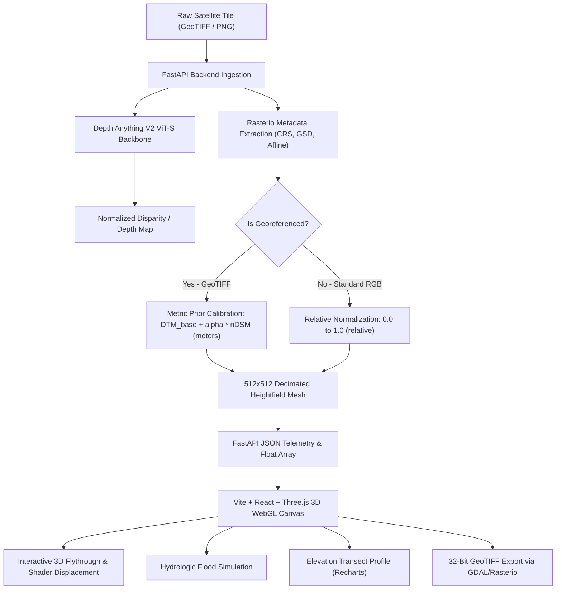

# 🧙‍♂️ DepthWizard — Single-View Optical Satellite RGB to Metric DSM
### Problem Statement SIH26175 · Smart India Hackathon 2026 · ISRO Space Applications Centre (SAC)

[](https://www.python.org/downloads/)
[](https://pytorch.org/)
[](https://fastapi.tiangolo.com/)
[](https://react.dev/)
[](https://threejs.org/)
[](https://vitejs.dev/)
[](LICENSE)

**DepthWizard** is an agile, AI-powered geospatial platform designed for **ISRO SAC** that reconstructs high-fidelity **Digital Surface Models (DSMs)** directly from a **single overhead optical satellite RGB image**, rendering an interactive 3D WebGL flythrough environment with realtime hydrologic flood simulation, cross-section elevation profiling, and 32-bit GeoTIFF export.

---

## 🌟 Key Capabilities & Unique Value Propositions (UVPs)

| Feature | Technical Implementation | Practical Utility |
|---|---|---|
| **🛰️ Single-View Monocular DSM** | Fine-tuned `Depth Anything V2 ViT-S` using combined **SILog** and **Sobel Edge-Gradient Matching** losses. | Eliminates reliance on costly stereo pairs or aerial LiDAR flights for rapid terrain mapping. |
| **📐 Dual Verification Testbeds** | Support for **Multispectral Satellite GeoTIFF** (`EPSG:32617`, `EPSG:32643`, sub-meter GSD, metric calibration in meters) and **High-Resolution Urban Optical** (Standard RGB PNG/JPG, normalized relative DSM $[0.0, 1.0]$). | Universal ingestion for raw georeferenced satellite products and standard high-contrast aerial photos. |
| **🌊 Hydrologic Inundation Simulator** | Real-time waterline threshold slider with GPU-accelerated percentage submergence calculation and disaster presets (`+2m High Tide`, `+10m Storm Surge`, `+25m Flash Flood`). | Instant disaster response, urban flood hazard mitigation, and sea-level rise modeling. |
| **✂️ Elevation Transect Profiler** | Dynamic 256-probe West-to-East centerline elevation sampling with Recharts cross-section rendering, base/peak metrics, and geomorphological gradient analytics. | Infrastructure planning, building height inspection, and structural verticality analysis. |
| **🗺️ 2D Ortho & Turbo DSM Inspection** | Side-by-side and split view inspection comparing radiometric optical tiles with Google Turbo perceptually uniform depth colorizations. | Visual quality assurance and building footprint alignment verification. |
| **💾 32-Bit OGC GeoTIFF Export** | Single-band `float32` Cloud-Optimized GeoTIFF raster export preserving original affine transform and CRS tags. | Direct interoperability with GIS software (QGIS, ArcGIS, GDAL). |

---

## 🏗️ System Architecture & Mathematical Engine



### 1. Depth Estimation Backbone
- **Model**: `Depth-Anything-V2-Small-hf` (24.8M parameters).
- **Fine-Tuning Dataset**: `earthflow/GAMUS` (DFC2019 Jacksonville/Omaha co-registered overhead optical + nDSM LiDAR pairs).
- **Loss Formulation**:
  $$\mathcal{L} = \mathcal{L}_{\text{SILog}}(d, d^*) + \lambda \mathcal{L}_{\text{Grad}}(d, d^*)$$
  Where $\mathcal{L}_{\text{SILog}}$ enforces scale-invariant depth consistency and $\mathcal{L}_{\text{Grad}}$ sharpens architectural building edges using horizontal and vertical Sobel filter convolutions.

### 2. Metric Prior Calibration
For georeferenced GeoTIFF inputs, bare-earth terrain ($DTM_{base}$) is isolated via morphological decomposition:
$$DSM(x, y) = DTM_{base}(x, y) + \alpha \cdot nDSM(x, y)$$
Producing real-world elevations in **meters** scaled by the physical Ground Sampling Distance (GSD).

---

## 💻 Hardware & Software Requirements

- **Operating System**: Windows 10/11 or Linux (Ubuntu 20.04+).
- **Python**: `3.10` or `3.11` (recommended).
- **Node.js**: `18.x` or `20.x` LTS.
- **GPU (Recommended)**: NVIDIA GPU with CUDA support (e.g. RTX 3060/4060 or higher). Inference runs in ~250–650 ms on CUDA `fp16`.
- **CPU (Fallback)**: Fully supported; will automatically default to PyTorch CPU device if no CUDA device is detected.

---

## 🚀 Quickstart & Installation Guide

### Step 1: Clone the Repository & Initialize Git LFS
```bash
# Clone the repository
git clone https://github.com/rishabhahuja12/Depth-Wizard.git
cd Depth-Wizard

# Pull model weights tracked by Git LFS
git lfs install
git lfs pull
```

### Step 2: Set Up Python Backend
```bash
# Create and activate virtual environment
python -m venv .venv

# On Windows:
.venv\Scripts\activate
# On Linux / macOS:
# source .venv/bin/activate

# Install dependencies
pip install -r backend/requirements.txt
```

### Step 3: Set Up Frontend
```bash
cd frontend
npm install
cd ..
```

### Step 4: Launch DepthWizard
You can launch both the backend API and frontend dev server with a single click or command:

#### Option A: One-Click Windows Batch Script
```bat
run_local.bat
```

#### Option B: Manual Launch (Two Terminals)
**Terminal 1 (Backend API):**
```bash
# From project root:
.venv\Scripts\python.exe backend/run_server.py
# Server runs on: http://127.0.0.1:8000
```

**Terminal 2 (Frontend Dev Server):**
```bash
cd frontend
npm run dev
# Vite dev server runs on: http://localhost:5173
```

Now open **`http://localhost:5173`** in Google Chrome or Microsoft Edge.

---

## 📂 Project Structure

```
DepthWizard/
├── backend/
│   ├── app/
│   │   ├── api/
│   │   │   ├── routes.py          # FastAPI endpoints (/api/upload, /api/export, /api/health)
│   │   │   └── schemas.py         # Pydantic response models
│   │   ├── core/
│   │   │   └── config.py          # App settings, paths, CORS
│   │   ├── services/
│   │   │   ├── depth_estimator.py # Depth Anything V2 ViT-S PyTorch inference
│   │   │   ├── calibration.py     # Bare-earth morphological DTM + nDSM metric engine
│   │   │   ├── mesh_builder.py    # Decimated 512×512 3D mesh generator
│   │   │   └── exporter.py        # 32-bit single-band GeoTIFF raster generator
│   │   └── main.py                # FastAPI app initialization
│   ├── training/
│   │   ├── losses.py              # SILog + Sobel Edge Gradient loss functions
│   │   ├── train_gamus_full.py    # GAMUS / DFC2019 fine-tuning loop
│   │   └── evaluate_val_benchmark.py # Quantitative validation script
│   ├── weights/
│   │   ├── best_model.pth         # Fine-tuned model checkpoint (Epoch 3, loss 0.1499)
│   │   └── final_model.pth        # Exported model weights
│   ├── requirements.txt           # Python dependency specifications
│   └── run_server.py              # Backend launcher script
├── frontend/
│   ├── src/
│   │   ├── components/
│   │   │   ├── TerrainCanvas.tsx  # Three.js WebGL 3D terrain canvas with custom shaders
│   │   │   ├── FloodSimulator.tsx # Hydrologic inundation controls & threat analysis
│   │   │   ├── CrossSection.tsx   # Recharts centerline elevation transect profile
│   │   │   ├── DualViewer.tsx     # 2D Ortho & Turbo DSM side-by-side inspection
│   │   │   ├── SettingsPanel.tsx  # Surface vertical exaggeration & spatial telemetry
│   │   │   ├── ContourOverlay.tsx # Topographic contour vector lines
│   │   │   ├── ColorBar.tsx       # Elevation colormap ramp legend
│   │   │   └── Dropzone.tsx       # Dual-testbed drag-and-drop file ingestion
│   │   ├── hooks/
│   │   │   └── useInference.ts    # API communication hook with progress state
│   │   ├── styles/
│   │   │   └── globals.css        # Exaggerated Minimalism design system
│   │   ├── App.tsx                # Main application view & tab state manager
│   │   └── main.tsx               # React DOM root
│   ├── package.json               # Node.js dependencies
│   ├── vite.config.ts             # Vite build configuration with API proxy
│   └── index.html                 # HTML entry point with Monumental typography
├── docs/                          # Architectural Plans, Bibles & Hackathon Documentation
│   ├── DEPTHWIZARD_MASTER_PLAN.md # Master plan: single-view RGB to DSM, 50% accuracy + 50% UX
│   ├── DEPTHWIZARD_FRONTEND_BIBLE.md # Complete frontend design & 3D WebGL flythrough engine guide
│   ├── DEPTHWIZARD_IMPLEMENTATION_BIBLE.md # Mathematical formulations, DTM/nDSM & pipeline details
│   ├── GAMUS_TRAINING_PLAN.md     # GAMUS / DFC2019 fine-tuning strategy & hyperparameters
│   ├── RTX4060_EXECUTION_PLAN.md  # GPU compute execution, AMP fp16 & CUDA benchmark
│   ├── FLASH_MASTER_PROMPT.md     # Agent system prompts and full context documentation
│   └── SIH26175_ISRO_SAC_PROBLEM_STATEMENT.md # Official ISRO SAC problem statement & rubric
├── test_datasets/                 # Curated verification testbeds (Ready to test)
│   ├── geotiff_mode/              # 4 GeoTIFF tiles (EPSG:32617 & EPSG:32643, 0.33m–0.50m GSD)
│   └── optical_mode/              # 4 Standard Optical tiles (PNG / JPEG, up to 1024×1024)
├── test_results/                  # 16 full-resolution browser verification screenshots
├── MULTI_IMAGE_VERIFICATION_REPORT.md # Empirical verification audit report
├── WALKTHROUGH.md                 # Complete implementation walkthrough
├── DEPTHWIZARD_FULL_AUDIT.md      # Full system audit and design validation
└── run_local.bat                  # One-click Windows launch script
```

---

## 🧪 Testing Both Verification Testbeds

DepthWizard comes pre-packaged with verified test images in `test_datasets/`. You can test both testbeds instantly:

### Testbed 1: REAL SATELLITE TILES (Multispectral Satellite GeoTIFF)
1. On the landing page, click **LOAD GEOTIFF** or drag an image from `test_datasets/geotiff_mode/`:
   - `01_geotiff_full_1024.tif` — Full 1024×1024 urban tile (`EPSG:32617`, 0.33m GSD).
   - `04_geotiff_isro_utm43_512.tif` — ISRO Indian UTM Zone 43N tile (`EPSG:32643`, 0.50m GSD).
2. **Expected Verification Outputs**:
   - Header badge indicates `EPSG:32617 (METRIC)` or `EPSG:32643 (METRIC)`.
   - Base and Peak elevations display physical metric heights (e.g. `0.0 meters` to `70.6 meters`).
   - Pixel GSD displays exact sub-meter resolution (`0.33m` or `0.50m`).
   - Click **EXPORT GEOTIFF** to download a valid 32-bit single-band float GeoTIFF raster.

### Testbed 2: OPTICAL RGB (High-Resolution Urban Optical)
1. Click **LOAD PNG** or drag an image from `test_datasets/optical_mode/`:
   - `01_optical_urban_1024.png` — 1024×1024 dense metropolitan block.
   - `02_optical_commercial_512.png` — 512×512 commercial complex.
2. **Expected Verification Outputs**:
   - Header badge indicates `RELATIVE DSM`.
   - Base and Peak elevations normalize to $[0.0, 1.0]$.
   - Full 3D surface mesh draped with optical texture, interactive flood simulation, and cross-section transects.

---

## 📡 API Reference

### `POST /api/upload`
Upload a satellite image (`.tif`, `.tiff`, `.png`, `.jpg`, `.jpeg`) for inference and mesh synthesis.
- **Query Parameters**:
  - `estimate_uncertainty` (`bool`, default `false`): Compute Monte Carlo dropout / variance confidence map.
- **Response**:
  ```json
  {
    "request_id": "c895fda0",
    "is_georef": true,
    "crs": "EPSG:32643",
    "inference_time_ms": 421.5,
    "confidence_mean": 0.892,
    "calibration": {
      "mode": "metric_prior",
      "min": 0.0,
      "max": 70.615,
      "unit": "meters"
    },
    "mesh_stats": {
      "vertices": 262144,
      "triangles": 522242,
      "pixel_size": 0.50,
      "elevation_min": 0.0,
      "elevation_max": 70.615
    }
  }
  ```

### `GET /api/export/{request_id}`
Download the 32-bit single-band float GeoTIFF raster for a completed inference run.
- **Response**: Binary stream with `Content-Type: image/tiff`.

### `GET /api/health`
System diagnostic and GPU VRAM check.
- **Response**:
  ```json
  {
    "status": "ok",
    "gpu": "NVIDIA GeForce RTX 4060 Laptop GPU",
    "vram_gb": 8.59
  }
  ```

---

## 🎨 Design Philosophy: Exaggerated Minimalism

DepthWizard's user interface is crafted under the **Exaggerated Minimalism** design paradigm:
- **Monochromatic Obsidian (`#050608`) and Pure White (`#FFFFFF`)**: High contrast, razor-sharp visual hierarchy.
- **Monumental Stroke Typography**: Outlined architectural headers with razor-thin tracking.
- **Hairline Borders (`rgba(255, 255, 255, 0.15)`)**: Clean geometric separation without ambient glow shadows.
- **Anti-AI-Slop Directives**: Zero marshmallow-rounded cards, zero generic gradient buttons, zero fuzzy glow halos, and zero placeholder content.

---

## 🏆 Smart India Hackathon 2026 Team & Attribution

Developed for **Problem Statement SIH26175** — *Single-View Optical Satellite RGB to Metric DSM*, sponsored by **Space Applications Centre (ISRO), Department of Space, Government of India**.
