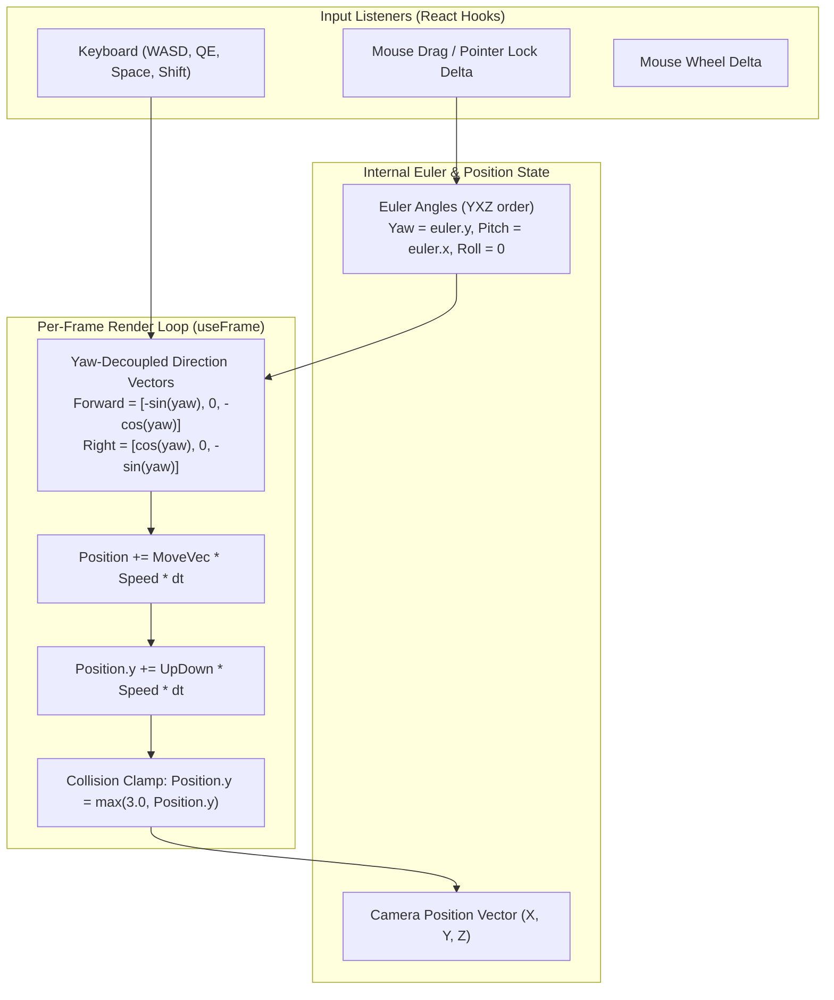
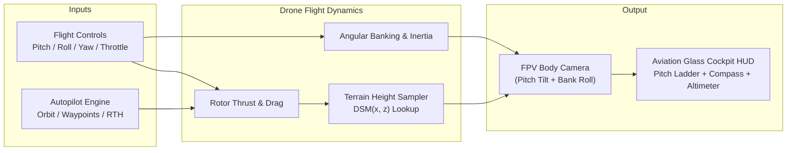

# DepthWizard: Navigation Engine & First-Person Drone Flight Mechanics Audit

---

## 1. Executive Summary

DepthWizard currently features a **custom 6-DOF (Degrees of Freedom) Spectator/Free-Fly Navigation Engine** implemented directly in Three.js and React Three Fiber. 

While it is responsive and well-tuned for inspecting terrain, building heights, and flood contours from an overview perspective, it operates as a **kinematic spectator camera (linear displacement without mass or physics)** rather than a **true First-Person View (FPV) Drone Flight Simulator**.

This document breaks down:
1. **Existing Code Implementation**: Exact data structures, math, inputs, and event loops.
2. **Current Strengths & Limitations**: What works well vs. what breaks immersion.
3. **True First-Person Drone (FPV) Blueprint**: The mathematical physics, aerodynamics, gimbal, HUD telemetry, and collision architecture required to convert this into a real drone flight experience.

---

## 2. Current Implementation Audit (What Exists in Code)

The camera engine is implemented in [`frontend/src/components/TerrainCanvas.tsx`](file:///Users/tanishporwal/Desktop/depthwizard/frontend/src/components/TerrainCanvas.tsx#L220-L360) and mirrored in [`frontend/src/components/VoxelTerrain.tsx`](file:///Users/tanishporwal/Desktop/depthwizard/frontend/src/components/VoxelTerrain.tsx).



### 2.1 Camera Orientation & Gimbal System
* **Euler Order**: `YXZ` intrinsic order (`new THREE.Euler(0, 0, 0, 'YXZ')`).
* **Yaw & Pitch Decoupling**:
  * Mouse horizontal movement ($\Delta X$) modifies **Yaw** (`euler.y -= deltaX * 0.003`).
  * Mouse vertical movement ($\Delta Y$) modifies **Pitch** (`euler.x -= deltaY * 0.003`).
  * Pitch is rigidly clamped between $-72^\circ$ and $+72^\circ$ (`Math.max(-Math.PI / 2.5, Math.min(Math.PI / 2.5, euler.current.x))`) to prevent gimbal lock / camera flipping.
  * **Roll is strictly locked to zero** (`euler.current.z = 0`).
* **First-Click Snap Prevention**: On component mount, the initial Euler orientation is extracted from the camera quaternion (`euler.current.setFromQuaternion(camera.quaternion, 'YXZ')`).

### 2.2 Translation & Flight Vectors
Translation is calculated every frame inside `@react-three/fiber`'s `useFrame((_, delta) => ...)`:
1. **Delta Time Clamping**:
   $$dt = \min(\Delta t, 0.1)$$
   Prevents large physics jumps when switching browser tabs.
2. **Yaw-Decoupled Planar Movement**:
   Unlike standard Three.js `FlyControls` which fly downward when looking downward, DepthWizard decouples horizontal cruising from camera pitch:
   $$\vec{F}_{\text{forward}} = \begin{bmatrix} -\sin(\text{yaw}) \\ 0 \\ -\cos(\text{yaw}) \end{bmatrix}, \quad \vec{R}_{\text{right}} = \begin{bmatrix} \cos(\text{yaw}) \\ 0 \\ -\sin(\text{yaw}) \end{bmatrix}$$
3. **Velocity Scaling**:
   * Standard Cruise Speed: $20.0\text{ units/s}$
   * Turbo Boost (`Shift`): $60.0\text{ units/s}$ ($3\times$ acceleration)
4. **Altitude Control**:
   * World vertical displacement along the global $Y$-axis: `Q` / `Space` $\to +Y$ (Ascent), `E` $\to -Y$ (Descent).

### 2.3 Zoom & Collision Guard
* **Directional Dolly Zoom**: Mouse wheel scrolls along the camera's true line of sight (`camera.getWorldDirection(dir)`).
* **Distance-Adaptive Step**: Zoom step is proportional to altitude:
  $$\text{step} = \text{clamp}(\|\vec{P}\| \times 0.08, 1.0, 10.0)$$
* **Subterranean Collision Clamp**:
  $$\text{Position}.y = \max(3.0, \text{Position}.y)$$
  A hard-coded floor prevents the camera from penetrating below the ground grid plane ($y = 0$).

---

## 3. Current Engine vs. True First-Person Drone (FPV)

| Feature | Current Spectator Implementation | True First-Person Drone (FPV) Physics |
|---|---|---|
| **Acceleration / Inertia** | Instant on/off velocity ($V = 20$ or $0$). Camera stops dead when key is released. | **Smooth Newton Dynamics**: Mass, thrust acceleration curve, linear drag ($\vec{F}_{\text{drag}} = -c_d \vec{V}^2$), momentum drift. |
| **Banking / Roll Dynamics** | Locked to zero (`euler.z = 0`). Strictly upright at all times. | **Aerodynamic Banking**: Rotates around $Z$-axis into turns ($\text{Roll} \propto -\text{YawRate} \times \text{Speed}$). |
| **Pitch Tilt on Thrust** | Pitch only changes when the user manually moves the mouse. | **Thrust-Pitch Coupling**: Drone tilts nose down ($-5^\circ$ to $-15^\circ$) when accelerating forward, leveling off when hovering. |
| **Terrain Collision (AGL)** | Hard-coded global floor: $y \ge 3.0$. | **Dynamic AGL (Above Ground Level)**: Samples the underlying DSM height $Z_{\text{terrain}}(x, z)$ and prevents flying through tall buildings or cliffs. |
| **Gimbal Pitch Mode** | Free mouse look only. | **Selectable Gimbal**: FPV Fixed Camera (locked to drone body) vs. 3-Axis Stabilized Gimbal (DJI Mavic style). |
| **Autopilot / Waypoint Cruising** | Manual control only. | **Automated Flight Paths**: 360° Point-of-Interest (POI) Orbit, Reconnaissance Transect Grid, and Spline Tour. |
| **Cockpit HUD / Telemetry** | Basic keybinding legend card in bottom-left. | **Aviation OSD (On-Screen Display)**: Artificial horizon ladder, heading compass tape, altimeter (MSL & AGL), groundspeed gauge. |

---

## 4. Blueprint for First-Person Drone Flight (FPV) Mode

To turn DepthWizard into a realistic aerial drone simulation over reconstructed satellite elevation models, the following modules can be added:



### 4.1 Physics & Aerodynamics Formulation
Instead of setting position directly (`position.add(move)`), the drone maintains a velocity vector $\vec{v}$ and angular velocity $\vec{\omega}$:

$$\vec{a} = \frac{\vec{F}_{\text{thrust}}}{m} - k_{\text{drag}} \vec{v}$$
$$\vec{v}_{t+1} = \vec{v}_t + \vec{a} \cdot \Delta t$$
$$\vec{p}_{t+1} = \vec{p}_t + \vec{v}_{t+1} \cdot \Delta t$$

#### Aerodynamic Banking into Turns:
When turning with `A` or `D`, the drone rolls along its local forward axis:
$$\text{Roll}_{\text{target}} = -\text{clamp}\left(v_{\text{lateral}} \times 0.05 + \dot{\psi} \times 0.2, -0.45, 0.45\right)\text{ rad}$$
$$\text{Roll}_{t+1} = \text{lerp}(\text{Roll}_t, \text{Roll}_{\text{target}}, 10 \cdot \Delta t)$$

---

### 4.2 Dynamic Terrain Collision (Real-Time AGL)
DepthWizard already possesses `dsm_raw` (the $512 \times 512$ elevation matrix client-side).
A drone at world coordinate $(x_w, z_w)$ can sample the physical elevation directly underneath it:

```typescript
function getTerrainElevationAt(x: number, z: number, dsmRaw: number[][], meshStats: any): number {
  const normX = (x / (meshStats.width * 0.1)) + 0.5; // [0, 1]
  const normZ = (z / (meshStats.height * 0.1)) + 0.5; // [0, 1]
  
  if (normX < 0 || normX >= 1 || normZ < 0 || normZ >= 1) return 0;
  
  const col = Math.floor(normX * (dsmRaw[0].length - 1));
  const row = Math.floor(normZ * (dsmRaw.length - 1));
  return dsmRaw[row][col];
}
```
* **Enforced Clearance**: $\text{Altitude}_{\text{drone}} \ge Z_{\text{terrain}}(x, z) + 1.5\text{m}$.
* **Benefit**: Flying over a $40\text{m}$ building automatically pushes the drone up or detects a rooftop collision rather than clipping through solid walls.

---

### 4.3 Automated Cinematic Flyby Modes
1. **Orbital Point-of-Interest (POI) Recon**:
   * Camera automatically circles the center of the satellite tile at a fixed radius and altitude:
     $$X(t) = R \cos(\omega t), \quad Z(t) = R \sin(\omega t), \quad Y = H_{\text{cruise}}$$
     $$\text{camera.lookAt}(0, Y_{\text{terrain}}, 0)$$
2. **Terrain-Hugging Transect Tour**:
   * Cruises west-to-east along the cross-section centerline sampled by `CrossSection.tsx`, gliding $5\text{m}$ over the terrain surface.

---

### 4.4 Glass Cockpit FPV HUD Overlay
An authentic military/reconnaissance drone Heads-Up Display:
* **Pitch Ladder / Artificial Horizon**: Tilting lines in the center of the screen indicating drone pitch and roll.
* **Compass Tape**: Rolling $000^\circ - 360^\circ$ heading bar at top center.
* **Flight Telemetry Boxes**:
  * **ALT (MSL)**: True sea-level altitude in meters.
  * **RADAR ALT (AGL)**: Distance between drone and the rooftop/ground below.
  * **SPD**: Current flight velocity in $\text{km/h}$ or $\text{m/s}$.
  * **COORDINATES**: Realtime projected UTM easting/northing or geographic lat/lon calculated from the GeoTIFF affine transform.

---

## 5. Summary & Next Steps

* **Current Status**: The manual 6-DOF controls are rock-solid for inspecting terrain and navigating around the map.
* **Ready for FPV Drone**: All necessary ingredients (elevation matrix `dsm_raw`, Three.js canvas, real-time animation loop, and UI controls) are already in place.
* When you are ready to implement, we can build the **FPV Drone Flight Controller + Cockpit HUD + Cinematic Autopilot Flyby** as a dedicated camera mode toggle right alongside the existing controls.

---

*Archived in `reports/drone_and_navigation_mechanics_report.md`*.
